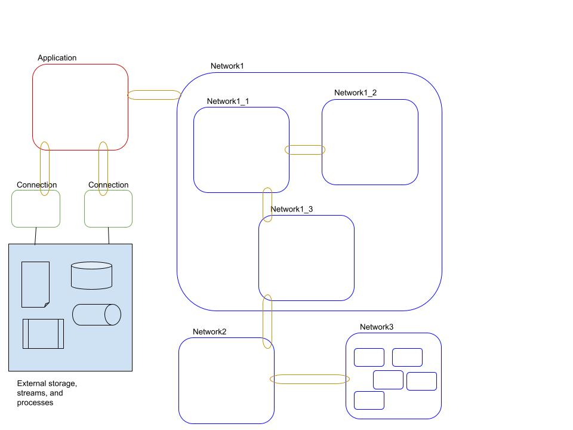
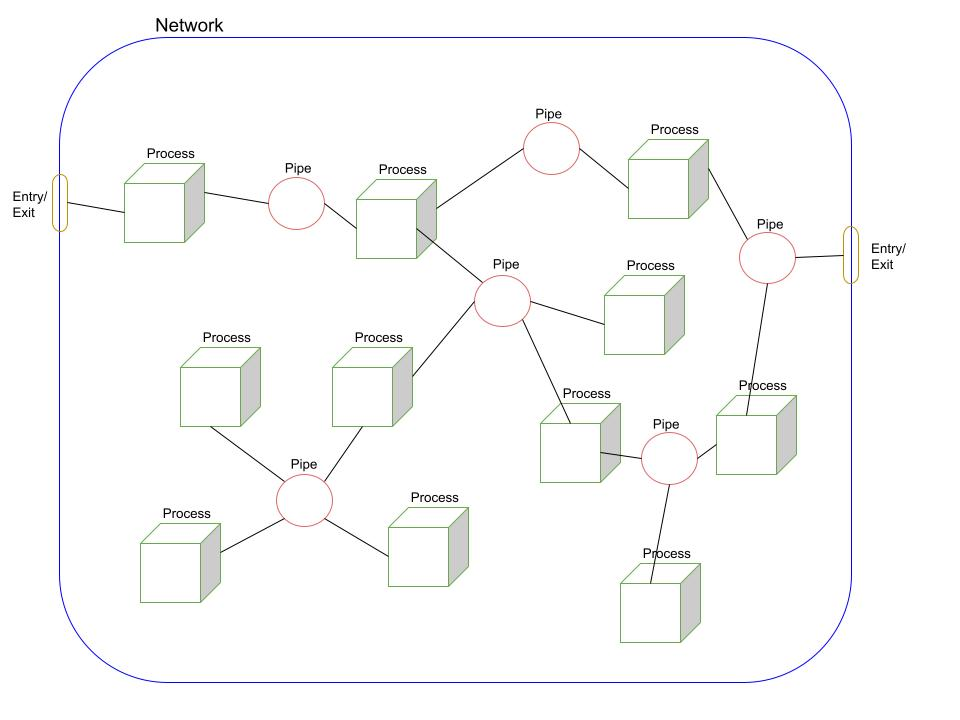

# Architecture

This document describes how NPL works for those that like to get under the hood. If you want to read about what it does, instead of how it does it, then take a look at the [language guide](LANGUAGE.md).

# Concept

## Applications

An NPL application comprises:
- A number of Networks defined by the application code. Each netwoek can be made up of other networks etc to whatever depth is needed to implement the features of the application.
- A number of Networks imported from shared Packages. These Networks can contain a hierarchy of other Networks, and can reference Networks defined in other shared Packages.
- Refrences to build-in Connections, or Connections that are defined in shared Packages.
- An Application definition that configures Connections, and routes Messages between the Connections and the Networks.

This is depicted below:

In this depiction, the Application definition is a red rounded rectangle. It is the only thing that exchanges Messages directly with Connections. Connections are the only thing that can connect to anything outside of the application, this includes databases, file systems, data streaming platforms, REST services, SaaS APIs etc.

Connections contain no Application specific functionallity, and can be shared by many Applications. Connections contain definitions of Messages that they emit, and Messages that they can process, and can be configured by the application.

To run the software in different environments, you can create multiple Application definitions, one for each environment. You can also build integration tests as Application definitions.

The blue rounded rectangles are Networks. Networks are interconnected by Pipes. Pipes route Messages and are elastic and asyncrhronous.

Vertical scaling can be confgiured at the network level. Pipes that route messages between Networks will be in-memory for Networks running on the same Kubernetes Pod, and will use system networking between Networks that are running on different Kubernetes Pods.

## Networks

At the larger scale, an NPL Application consists of a hierarchical organization of interconnected Networks. Within each Network there are:

- Processes perform computational logic. Processes know how to handle specific types of Message, and emit other Messages as the result of their processing. Processes can also emit messages and wait for responses befrore continuing their processing.
- Pipes are elastic, asyncronous, and implement Message routing logic. Pipes are also durable, and guarantee to deliver each message at least once after it is sucesfully emmitted by a process. Pipes defined within a network are always in-memory and very high performance.

This can be depicted as follows:

Networks must have entry/exit points to be useful. Messages are received from other Networks over these Entry Points, and messages emitted by the processes within the Network can be sent to other Networks via these Entry Points.

It is important for flexibility, single responsibiluty and reusability, that processes are completely self-contained, with no knowledge of any other Processes within the system. Processes only have knowledge of the Messages that they can process, and the Messages that they emit.

Note that processes are supposed to be very simple, performing just one relatively simple task. For example a process might accept a message describing an update, and translate it into a SQL statement. In this case the Pipes will route update request Messages to this Process for translation into SQL statement messages, and the Application definition will route these messages to the database Connection. Any response Messages emitted from the Connection will automatically be routed back to the originator, but Pipes involved in the routing could inject additional Processes to perform additional transformations.

# Runtime environment

For the initial PoC the plan is to translate NPL code into TypeScript, and write the NPL runtime in TypeScript. The process of compiling and running an NPL program in this case would be:
 
 1. Take the NPL application code and translate into TypeScript.

 1. Pass the NPL runtime and the translated NPL code to the TypeScript compiler.

 1. Run the resulting JavaScript in Node.js.

 In future iterations of NPL we plan to compile it into other formats to provide more runtime options.

 For local development, you can run the entire application as a single Node.js application, and use the Node.js debugger to set breakpoints and step through the code in a similar way to how it works with TypeScript.

 For production environments, we plan to provide tooling that will split your application into multiple docker containers and orchestrate them using Kubernetes based on a simple configuration file that defines which networks should run in each vertical slice.
