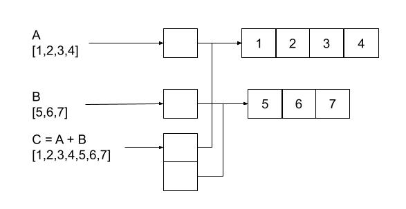

# Comparing NPL with Object Oriented Programming

If you are used to programming in an OOP language, it might take a bit of time to get accustomed
to a different way of thinking about how to construct software. If you have done some Functional 
Programming then most of what you learned there will be applicable here, but there are still a 
few new concepts to understand. In some ways NPL is the next logical evolution after Functional 
Programming. Procedural -> Object Oriented -> Functional -> Network.

## Stack trace

In an object oriented application, your code will call methods of objects. These methods will call
methods of other objects etc. In order to return back to the task in hand after calling a method, 
the local variables and return location are pushed onto a stack when a method is called, and poped 
off the stack when the method returns to the caller.

At any point in an object oriented program we can capture a stack trace that tells us how we got
to the method we are executing (the calling chain), and this is often captured automatically when
an exception is thrown. That's great as far as it goes, but it is only a very small part of the 
whole picture.

The stack trace might tell us that Method A called Method B, but it tells us nothing about what 
other methods A called before it called Method B. The stack trace is also not very useful after 
the processing is complete. If my software accepts a request, does some processing and produces 
a result, and I want to know how that result was produced, for example which methods were called, 
I can't see this, because the stack trace is ephemeral.

Because an NPL program works by passing messages through a sequence of processing steps, and because
messages have context, you can configure the NPL runtime to add some or all of the processing steps 
to the message context. When you configure this in NPL there are four levels of tracing detail
available: none, network, pipe and process level.

For production deployments you typically want no tracing for optimum performance. Setting the 
trace level to `network` instead will capture a list of network entry points that the message 
passes through. Increasing the trace level to `pipe` includes the pipes that processed the 
message, and `process` includes processes as well. The tracing level can be set at startup by 
adding the `--trace` option on the command line, and can also be changed in the context 
associated of each message. Tihs means that you can add code to enable more detailed tracing
for messages that meet some criteria.

If you only want to trace messages with particular characteristics, then you can modify your 
input pipe to route all messages through a process that sets the trace level for each message.
This message context is inherited by any messages produced as a result of processing this one, 
recursively, so you will end a complete picture of all of the processing that took place.

Note that if we were allowed to mutate messages, this would not provide a complete picture, 
because we could only see the end state of the messages. Because messages are immutable in NPL, 
when we look at the trace information, we can see exactly what the inputs were to each network,
pipe or process that were involved along the way. This is a much more powerful debugging tool 
than capturing a stack trace at a moment in time.

The concept of tracing exists in the broader networking concept too. Many service mesh 
implementations add trace ids to requests, and pass these from service to service so that tools 
like Honycomb can display a network topology and trace requests through the system. Tools like 
Honycomb also provide APIs that allow you to generate tracing information from within your 
application, but you have to integrate these APIs and remember to call the API at all relevant points.

The NPL runtime gives you this for free out of the box, and integrates with service mesh and 
observability tools like Honycomb.

## Immutability

A common question that comes up in the context of all functional programming systems, is "How is it 
possible to write a useful program without mutating state?".

It's a common misconception amongst programmers that have predominently been programming in a procedural 
or object oriented style, that you must design software by first defining all of the state, then 
defining how/when we are going to mutate that state. OOP in particular reinforces this view by making 
you write code that binds state and the mutation of that state together into a class, but this is not 
the only way to think about software.

Another way of thinking about software is that it accepts inputs (files, user interaction, data streams, 
network requests etc) performs some processing on those inputs, and produces some outputs. This model 
works at all levels.

At the topmost system level, the system might accept an http request and output a web page. To do this, 
the system might call a number of web services, which might call other web services, which might call 
databases, read from file systems etc. At each level it's just accepting inputs, processing and producing 
outputs. NPL extends this concept down into the application code.

In NPL, a process accepts messages, does some processing and produces output messages. These output 
messages are inputs to other processes. This is exactly the same as a REST microservice calling another 
REST microservice. In fact NPL deliberately blurs the line between what is an application and what is 
a service to enable vertical scalability.

Messages are immutable, and the data structures that they contain are also immutable, you can't change 
anything, so how can I build an application that clearly needs state. What if I want to write a compiler 
that takes a large set of source files and procuces a compiled executable, how can I do something like 
this without mutating state?

The anwser is that you can't mutate any data structure, but you can create new data structures out of 
existing ones. Lets take the simple example of having a list and wanting to add items to the list. In 
the OOP world, your runtime library will provide a mutatable list class with an `add` method that you 
can use. In functional languages like NPL, you create a new list that contains all of the elements of 
the original list plus the new one. At first this might seem inefficient, but remember everything is 
immutable, so there is never any need for deep copying, shallow copying always works in a functional 
world.

Lists implemented as arrays are not very efficient in functional languages, because you have to duplicate 
the array every time you modify it (although as noted above, you don't have to duplicate any of the data 
structures referenced by the array). However data structures that use references are extremely efficient, 
because the things that they reference are immutable, and hence the references can always be copied safely.

You can write a functional, immutable and efficient list class by making it a list of other lists. In this 
case if a list has a single reference to its only sub-list (which could contain many items), our `add` 
operation returns a new list with two sub-list references, one to the sub-list from the list we were adding 
to, and another to the list we are adding to it. This is illustrated below:

Other immutable structures like hash sets, trees etc can all be implemented efficiently. You will find these
implementations in the NPL runtime library.

There is some inneficiency here, but it's not as much as most programmers assume, and it is offset by
efficiency gains in other areas, for example we don't need any thread synchronization constructs, and we never
need to make deep copies of data structures.

Immutability has many advantages. One of the major benefits that you will notice if you are comming from an
OOP backround is that you don't have to make assumptions about the program state. Many of the bugs that get
introduced into OOP programs come from false assumptions about the state of an object. You can get coverage
reports from unit tests that ensure all code paths were followed, but what about all possible internal states
of the object?

So, what about the compiler that we wanted to write? In this case the state of the compiler should be contained
in a message, and the message should be passed around between processes. Each time we add to the compiler's model 
of the application it is compiling, we need to replace part of the model with a new, updated, version. If we 
use references (as per the list of sub-lists example above) then the operations of adding new identifiers, 
fixing up references and everything else the compiler has to do can all be done efficiently and immutably.

If you are still not convinced, there are a number of programmers that have written real-time games with a 
functional programming language - for example [Purely Functional Retrogames](https://prog21.dadgum.com/23.html).
I am not advocating writing a real-time game in a functional programming language, personally I would use Rust, 
but it does demonstrate that functional programming can be efficient even for applications with a lot of state.

## Encapsulation

We need encapsulation in OOP because we need to constrain the internal state of the object so that we can make 
assumptions about its state in the methods of the class. For example if there is no way that code outside of the 
class can set an internal field to null, then the methods of that calss can assume that the field will never be 
null. Since processes in NPL have no state, this is not applicable to NPL. We also can't invalidate the state of 
a message, because messages are immutable.

We also use encapsulation to break larger blocks of logic into smaller pieces without exposing the smaller pieces 
outside of the class. In NPL, processes cannot directly call each other, they can only emit messages and have 
those routed to other processes by pipes, so the internal details are not exposed regardless.

In NPL, networks are context boundaries (as well as vertical scaling boundaries). Networks can only exchange messages 
through their ingress and egress points. A process in Network A can not send a message to a process in Network B, 
it can only send a message to an ingress on Network B, and Network B will decide which process to pass the message
to. This means that we can completely redesign a network of processes without impacting the rest of the application
provided the network's ingress and egress points are unchanged.

## Inheritance

In the early days of OOP I fully embraced the whole OOP philosophy, and diligently implemented the principls of DRY 
by constructing class hierarchies that captured the similarities and differences between objects of various types, 
as did everyone else. At some point however, I realized that the class hierarchy is a vary stiff structure that 
is very hard to adjust when there is any significant change to the requirements of the application.

After several extremely painful refactorings of large applications, where altering the class hierarchy and getting 
back to another stable working version took multiple weeks, I decided to abandon inheritace altogether. At the time 
I was the CTO of the organization that I worked for, and I required any engineer thinking of adding inheritance to 
the codebase had to come talk to me first. There was no hard rule about not using inhertance, but every time an 
engineer came to talk to me about adding inheritance, they went away deciding not to use it, and in the five years 
that I was the CTO, no inheritance was added to the system.

When I was designing NPL, I definitely was not going to include inheritance. Message me if you think you have a use 
case where inheritance is the best solution, but in five years as CTO, every engineer that thought they had a use 
case was quickly convinced otherwise.

The alternative to inheritance is encapsulation. Instead of making a square that inherits from shape, where all 
shapes have an x and y property, we make square encapsulate a position object that has x and y properties. This 
is much more flexible, because it gives you the characteristics of multiple inheritance without the complexities 
of having multiple paths back to the same base class.

Encapsulation is a first class element of NPL. You can compose messages from other messages.

## Polymorphism

Polymorphic methods (or method overloads) are not really a thing in NPL because we don't have any methods. NPL does 
have a similar behavior though, because you can route many different kinds of message to a process, and it will 
perform processing logic that is specific to the type of message. This is somewhat like method or function overloading.

The concept of abstract or virtual methods being overriden in derived classes is not really a thing in NPL either,
because there is no support for inheritance. The main use of this type of polymorphims can be illustrated by the 
example of adding a virtual `toString()` method to `Object`, so that any object can be converted to a string 
representation without knowing what kind of object it is.

There is no direct equivalent to this in NPL because only messages could meaningfuly be represented as strings, 
and messages contain only data, no functionality. If you wanted to be able to convert messages into strings, 
then you could write a stringification process that accepts messages of various types and emits a standard 
message that just defines a string field.

## Abstraction

Abstraction is the idea that we can define a contract, and have multiple implemtations of that contract. In most 
OOP languages the contract is often defined with the `interface` reserved word, and the implementations of the 
contract use words like `implements`.

Again, there is no direct equivalent. Interfaces define a collection of methods that take certain parameters and 
return perticular types. If you think of the parameters to a method being similar to a message in NPL, then every 
NPL message is an interface with just one method, and any process that is able to process that message implements 
the intarface.

This analogy breaks down when it comes to the return value, because in OOP an interface also defines a single 
return value, whereas in NPL a process can emit any number of messages in response, and processes that process
the same message can emit different kinds of responses.
